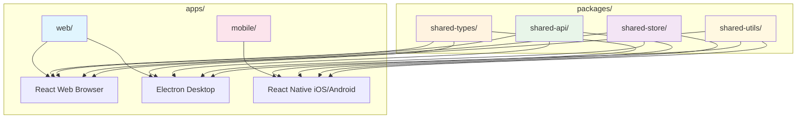
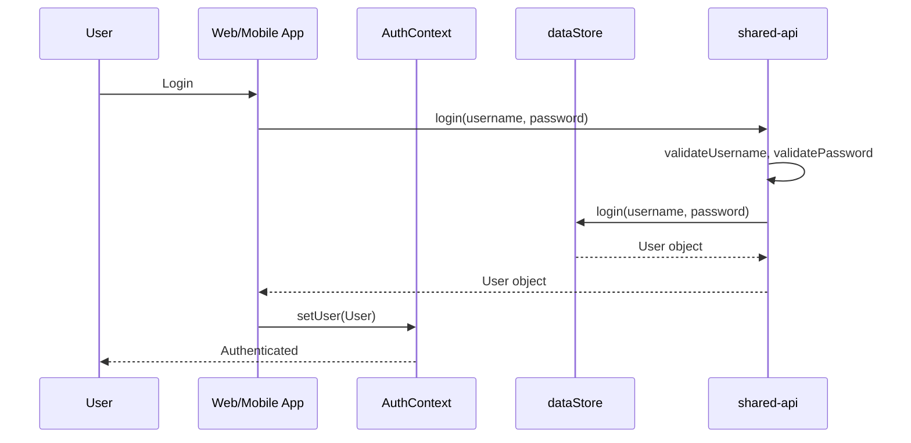

# Arsitektur Monorepo

## Diagram Struktur

## Alur Data

## Shared Components

| Package | Contents | Used By |
|---------|----------|---------|
| `shared-types` | User, Question, Comment, QuestionStatus | web, desktop, mobile |
| `shared-api` | ApiError, validators, auth, questions, comments | web, desktop, mobile |
| `shared-store` | dataStore, AuthContext | web, desktop, mobile |
| `shared-utils` | formatDate | web, desktop, mobile |

## Platform-Specific Components

| App | Components | Notes |
|-----|------------|-------|
| `web` | React components, Vite config, i18n | Browser-only features |
| `desktop` | Electron main, preload | Desktop-only features |
| `mobile` | React Native screens, navigation | Mobile-only features |
